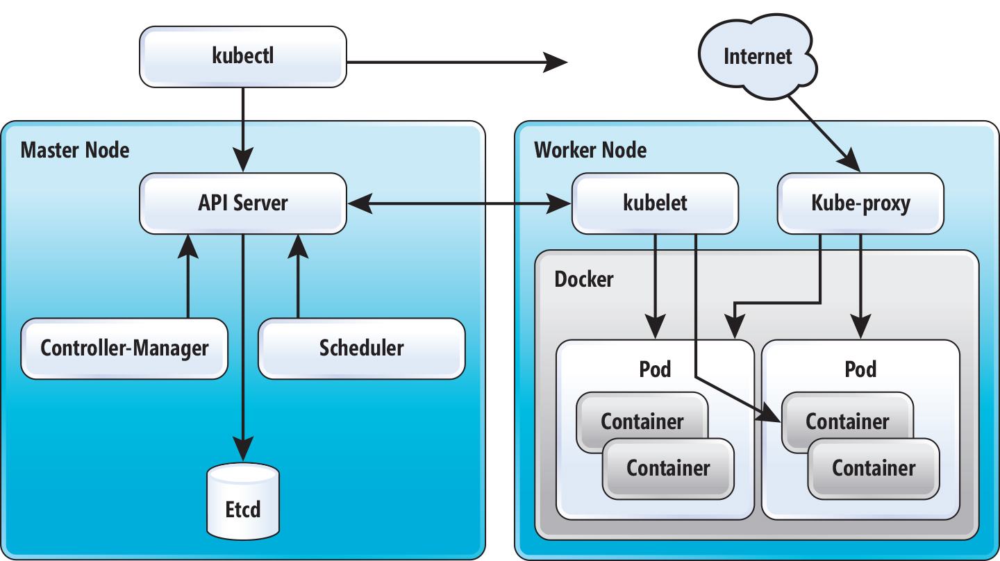

# System architecture

## K8s's Features:

- Deploy your applications quickly and predictably.
- Scale your applications on the fly.
- Seamlessly roll out new features.
- Optimize use of your hardware by using only the resources you need

## Architecture

- [etcd](#etcd)
- [API server](#API_server)
- [Controller Manager](#ControllerManager)
- [Schedule](#Schedule)
- [Agent](#Agent)
- [Proxy](#Proxy)
- [CLI](#CLI)

 
### etcd

Distributed key/value database, using [Raft Consensus](https://raft.github.io/) alghoritm. 

All cluster data is stored here.

etcd run on the master(s)

Peers requests listening on port `2380`

Clients requests listening on port `2370` 

 
### API server

Components communicate with each other through the REST API

Bind on 6443 for HTTPs and 8080 for HTTP communications 

 
### Controller Manager

Controller Manager (`kube-controller-manager`)  is a binary that runs controllers, which are the background threads that handle routine tasks. Include: 

- **Node Controller**: Responsible for noticing & responding when nodes go down.
- **Replication Controller**: Responsible for maintaining the correct number of pods for every replication controller object in the system.
- **Endpoints Controller**: Populates the Endpoints object (i.e., join Services & Pods).
- **Service Account & Token Controllers**: Create default accounts and API access tokens for new namespaces

Run on master(s), bind on port `10252`

 
### Schedule

`kube-scheduler` watches newly created pods that have no node assigned, and selects a node for them to run on

Run on master(s), bind on port `10251`

 
### Agent 

`kubelet` is primary node agent. 

Main responsibilities: 

- Watches for pods that have been assigned to its node
- Mounts the pod’s required volumes
- Runs the pod’s containers via docker
- Periodically executes container liveness probes
- Reports the status of the pod back to the rest of the system

Run on workers, bind on port `10250` and `10255`

 
### Proxy

Maintain network rules, perform connection forwarding 

Run on workers, bind on port `31080`
