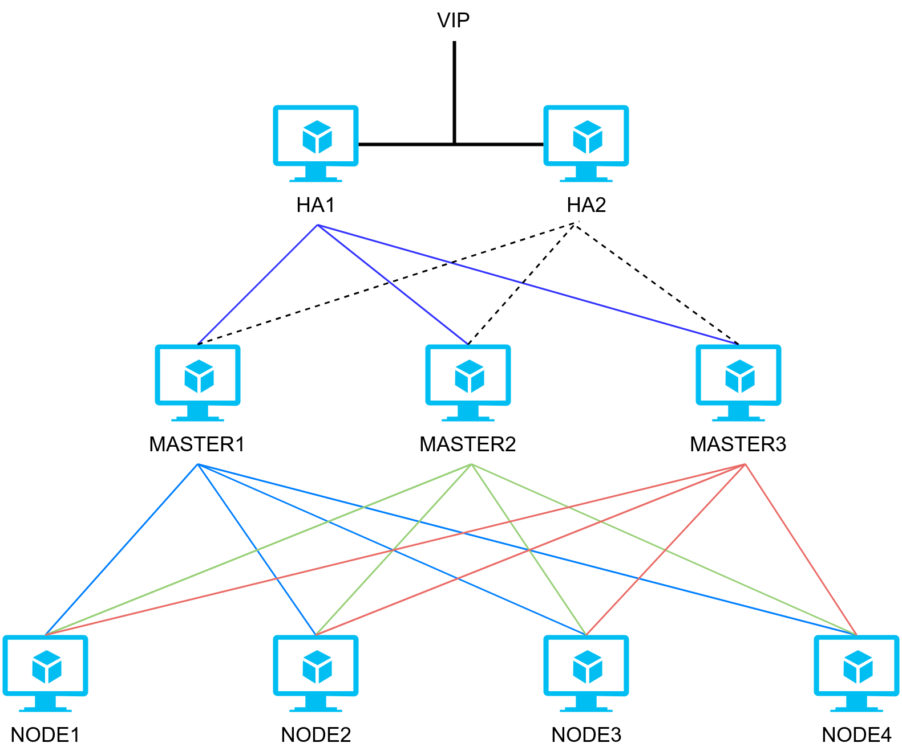

## Architecture



## Configuration parameters  

| NAME | IP address | Use |
|------|------------|-----|
| HA1 | 172.27.100.160 | LoadBalance for the Masters |
| HA2 | 172.27.100.161 | Backup for HA1 |
| MASTER1 | 172.27.100.176 | Master K8S |
| MASTER2 | 172.27.100.177 | Master K8S |
| MASTER3 | 172.27.100.178 | Master K8S |
| NODE1 | 172.27.100.180 | Node |
| NODE2 | 172.27.100.181 | Node |
| NODE3 | 172.27.100.182 | Node |
| NODE4 | 172.27.100.183 | Node |

VIP: `172.27.100.175`

HA-proxy used to load balance the requests to Masters.

Keepalived ensure that automatically failover to another HA-proxy if problems occur.

## Install  

- [1. Keepalived](#keepalived)
- [2. HAproxy](#haproxy)
- [3. Docker](#docker)
- [4. Kubectl, kubeadm, kubelet](#kubetool)
- [5. Initializing your master](#init)
- [6. Join cluster](#join)


### 1. Keepalived
<a name="keepalived"></a>
Execute commands on `HA1` and `HA2`

#### Enable IP forwarding on kernel

```bash
[root@ha1 ~]# cat >> /etc/sysctl.conf << EOF
net.ipv4.ip_forward = 1
EOF

[root@ha1 ~]# sysctl -p
```

#### Install keepalived 

```bash
[root@ha1 ~]# yum install -y keepalived psmisc
```

**Note:** `psmisc` used to run `killall` command in check script.

#### Configuration:

Edit file `/etc/keepalived/keepalived.conf` by following [keepalived.conf](../conf.d/keepalived.conf)

**Note:**
- state : `MASTER`  for HA1 and `BACKUP` for HA2
- interface 
- priority : `100` for HA1 and `99` for HA2. for electing MASTER, highest priority wins. (range 0-250)
- virtual_ipaddress

#### Restart service 
```bash
systemctl restart keepalived
systemctl enable keepalived
```

### 2. HAproxy
<a name="haproxy"></a>
Execute commands on `HA1` and `HA2`

```bash
[root@ha1 ~]# cat >> /etc/sysctl.conf << EOF
net.ipv4.ip_nonlocal_bind = 1
EOF
```

```bash
[root@ha1 ~]# sysctl -p
net.ipv4.ip_forward = 1
net.ipv4.ip_nonlocal_bind = 1
```


#### Disable SElinux 

```bash 
setenforce 0
sed -i 's/^SELINUX=enforcing$/SELINUX=permissive/' /etc/selinux/config
```

#### Disable firewalld 

```bash
systemctl stop firewalld
systemctl disable firewalld
```

#### Install haproxy 

```bash
yum install -y haproxy
```
#### Configuration 

Edit file `/etc/haproxy/haproxy.cfg` by following [haproxy.cfg](../conf.d/haproxy.cfg)

#### Restart service

```bash
systemctl restart haproxy
systemctl enable haproxy
```

Ensure that , port `16443` listening on all `HA` node:

```bash
netstat -an | grep 16443
```


### 3. Docker 
<a name="docker"></a>

Execute commands on all the `MASTER` and the `NODE`

```bash
yum install yum-utils device-mapper-persistent-data lvm2 -y
yum-config-manager \
    --add-repo \
    https://download.docker.com/linux/centos/docker-ce.repo
yum update -y && yum install docker-ce-18.06.2.ce -y

systemctl restart docker
systemctl enable docker
```

### 4. Kubectl, kubeadm, kubelet
<a name="kubetool"></a>

Execute commands on all the `MASTER` and the `NODE`

#### Add repo 

```bash 
cat <<EOF > /etc/yum.repos.d/kubernetes.repo
[kubernetes]
name=Kubernetes
baseurl=https://packages.cloud.google.com/yum/repos/kubernetes-el7-x86_64
enabled=1
gpgcheck=1
repo_gpgcheck=1
gpgkey=https://packages.cloud.google.com/yum/doc/yum-key.gpg https://packages.cloud.google.com/yum/doc/rpm-package-key.gpg
exclude=kube*
EOF
```

#### Disable SElinux 

```bash 
setenforce 0
sed -i 's/^SELINUX=enforcing$/SELINUX=permissive/' /etc/selinux/config
```

#### Install tool 

```bash
yum update -y
yum install -y kubelet kubeadm kubectl --disableexcludes=kubernetes
systemctl enable --now kubelet
```

#### Bypass iptable (issue on RHEL/CentOS 7)
```bash
cat <<EOF >  /etc/sysctl.d/k8s.conf
net.bridge.bridge-nf-call-ip6tables = 1
net.bridge.bridge-nf-call-iptables = 1
EOF
sysctl --system
modprobe br_netfilter
```

#### Disable swap

```bash
swapoff -a 
```

This will immediately disable swap. 

Then remove (or commend) any swap entry from `/etc/fstab`

Example: (the last line)

```
#
# /etc/fstab
# Created by anaconda on Sun Feb 24 12:58:41 2019
#
# Accessible filesystems, by reference, are maintained under '/dev/disk'
# See man pages fstab(5), findfs(8), mount(8) and/or blkid(8) for more info
#
/dev/mapper/centos-root /                       xfs     defaults        0 0
UUID=d7fcafc8-3a0d-4eb4-896d-fca16a533fc7 /boot                   xfs     defaults        0 0
#/dev/mapper/centos-swap swap                    swap    defaults        0 0
```

#### Disable firewalld 

```bash
systemctl stop firewalld
systemctl disable firewalld
```

#### Naming hosts 

```bash
cat << EOF >> /etc/hosts 
172.27.100.176 master1
172.27.100.177 master2
172.27.100.178 master3
172.27.100.180 node1
172.27.100.181 node2
172.27.100.182 node3
172.27.100.183 node4
172.27.100.175 cluster.kube.com
EOF
```
### 5. Initializing your master  
<a name="init"></a>

Execute commands on `MASTER1`
#### Create config file 

```bash 
cat << EOF >> kube-config.yml 
apiVersion: kubeadm.k8s.io/v1beta1
kind: ClusterConfiguration
kubernetesVersion: v1.13.1
apiServer:
  certSANs:
    - "cluster.kube.com"
controlPlaneEndpoint: "cluster.kube.com:16443"
networking:
  podSubnet: "10.244.0.0/16"
EOF
```

#### Init

```bash
kubeadm init --config kube-config.yml
```

and waitting ... 


#### Config 

```bash 
mkdir -p $HOME/.kube
sudo cp -i /etc/kubernetes/admin.conf $HOME/.kube/config
sudo chown $(id -u):$(id -g) $HOME/.kube/config
```

#### Apply network plugin (Flannel)


```bash
curl -O https://raw.githubusercontent.com/locvx1234/kubernetes-notes/master/conf.d/kube-flannel.yml
kubectl create -f kube-flannel.yml
```

### 6. Join cluster
<a name="join"></a>

#### Copy files related to other masters
Execute commands on `MASTER1`

```bash
ssh root@master2 mkdir -p /etc/kubernetes/pki/etcd
scp /etc/kubernetes/admin.conf root@master2:/etc/kubernetes
scp /etc/kubernetes/pki/{ca.*,sa.*,front-proxy-ca.*} root@master2:/etc/kubernetes/pki
scp /etc/kubernetes/pki/etcd/ca.* root@master2:/etc/kubernetes/pki/etcd

ssh root@master3 mkdir -p /etc/kubernetes/pki/etcd
scp /etc/kubernetes/admin.conf root@master3:/etc/kubernetes
scp /etc/kubernetes/pki/{ca.*,sa.*,front-proxy-ca.*} root@master3:/etc/kubernetes/pki
scp /etc/kubernetes/pki/etcd/ca.* root@master3:/etc/kubernetes/pki/etcd
```

#### Master join 
On `MASTER2` and `MASTER3`

At the end of the kubeadm init setup, we can see a command like that: 

```bash
kubeadm join cluster.kube.com:16443 --token 87zr96.5gzzy3we8175ecmt --discovery-token-ca-cert-hash sha256:aeec60dddc61ba7d5d2bbfc38baf553cef54814ccf6c346d6987b186edda32a8 --experimental-control-plane
```

Use that command to join cluster, applying to both of the masters and the nodes.

**Note:** Using `--experimental-control-plane` for the master to join 

#### Node join 
On all node `NODE1:4`

Using the command like that: 

```bash
kubeadm join cluster.kube.com:16443 --token 87zr96.5gzzy3we8175ecmt --discovery-token-ca-cert-hash sha256:aeec60dddc61ba7d5d2bbfc38baf553cef54814ccf6c346d6987b186edda32a8
```

**Tip** : If you didn't take note of the join command, you can get following command :

```bash
kubeadm token create --print-join-command 
```


## References 

https://blog.csdn.net/chenleiking/article/details/84841394

https://github.com/meditechopen/meditech-thuctap/tree/master/ThaoNV/HAProxy%20%2B%20KeepAlive

